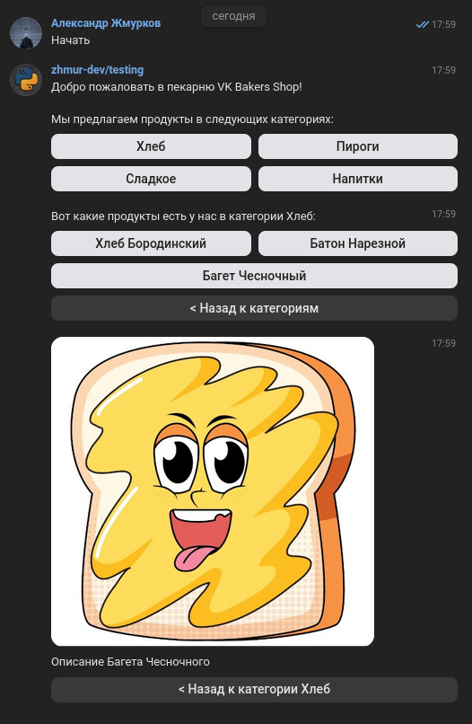

# VK Bakers Shop

## Description

A sample VK Bot functioning as a shop window for local bakery. Allows users to navigate to a particular product category and get details of a product which includes text description and a photo.



---

## Pre-requisites and Installation

### Get your VK Group ready
- Navigate to main view in your Group using administrator account and choose `Management` from the side panel.
- Navigate to `Settings` -> `API`.
- Pick `Create a key` and provide access to Group contents. You will need this key for variable `VK_TOKEN` in your `.env` file.
- When in `Settings` -> `API`, choose `Long Poll API` and turn it on.
- In the same section choose `Event types` and turn on all options under the headers *Messages* and *Users*.
- Exit `Settings` -> `API` from side menu, navigate to `Messages` section and turn on *Group messages*.
- Go to `Messages` -> `Settings for bot`.
- Turn on *Possibilities of bots* and *Add «Start» button*.

### Set up your server / local machine
>NB: This section provides instructions for a debian-based Linux distribution. If you are using a different operating system, please adapt accordingly.

1. Make sure that all necessary packages are installed at your server / local machine.

```
sudo apt update
sudo apt install git python3 python3-pip python3-venv nano postgresql systemd
```

2. Set up PostgreSQL database.

- Enable `postgresql` system service for automatic launch upon startup of the server / local machine.
```
sudo systemctl enable --now postgresql
```

- Create a user that will be the owner of your database - you will need this username as variable `POSTGRES_USER` in your `.env` file.
```
sudo -su postgres createuser <username>
```

- Set a password for your user - you will need this password as variable `POSTGRES_PASSWORD` in your `.env` file.
```
sudo -u postgres psql -c "ALTER USER <username> PASSWORD '<user_password>';"
```

### Prepare VKBakersShop for operation

- Clone the repository and cd into its main directory.
```
git clone git@github.com:zhmur-dev/VKBakersShop.git
cd VKBakersShop/
```

- Create and complete `.env` file based on the example provided by `.env.example` and using the data you have obtained at the stage of VK Group preparation and PostgreSQL setup. `VK_GROUP_ID` must only contain the digits that correspond to your VK Group ID in VK ecosystem.
```
nano .env
```

- Create and activate virtual environment, install requirements.
```
python3 -m venv venv
source venv/bin/activate
pip install --upgrade pip
pip install -r ../requirements.txt
```
---

## First start

- Launch VKBakersShop from root project directory.
```
python3 main.py
```

- Follow the interface to create database, populate it with sample data and launch the bot.

---

## Launching VK bot as systemd service

If all goes well, you might want to have the bot launched as system service upon the server startup.
- Pick `vk-bot.service` file from `infra` directory
- Specify the paths and server username in the file as suggested
- Copy the file to `/etc/systemd/system/` at your server
- Enable the service with `sudo systemctl enable --now vk-bot`

---

Stack: Python 3.12, PostgreSQL 16.3, vk_api 11.9

Developed by Alexander [zhmur-dev](https://github.com/zhmur-dev) Zhmurkov in 2024